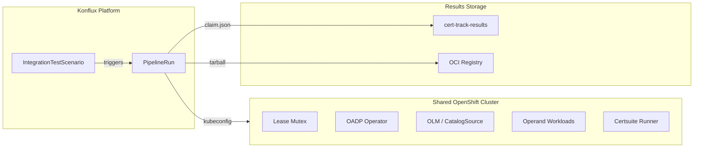
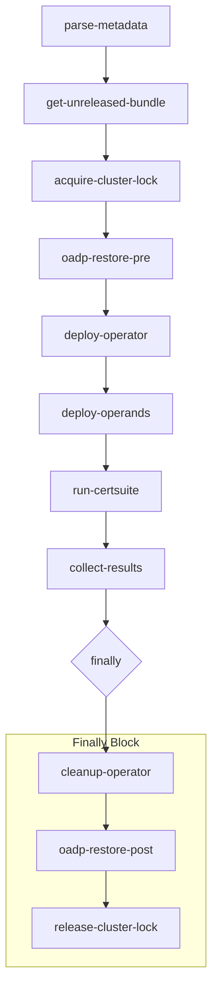
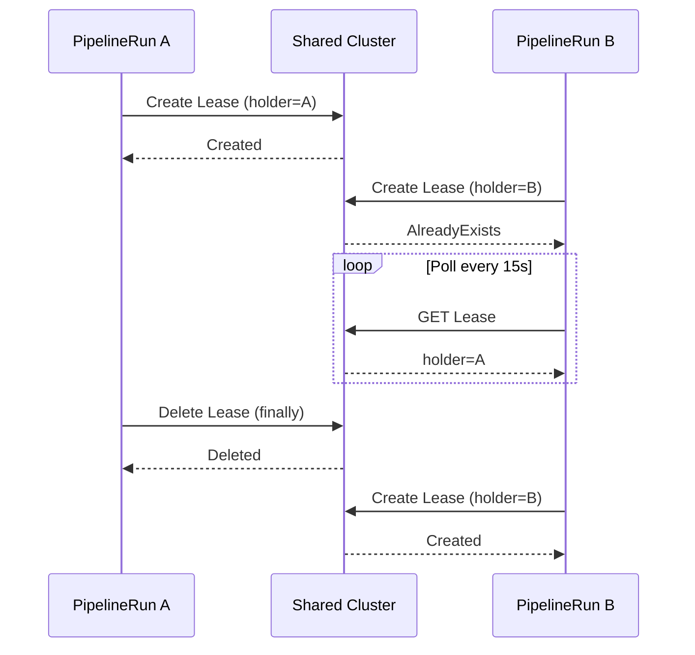
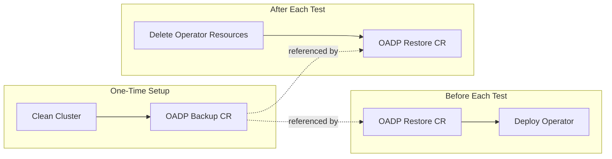
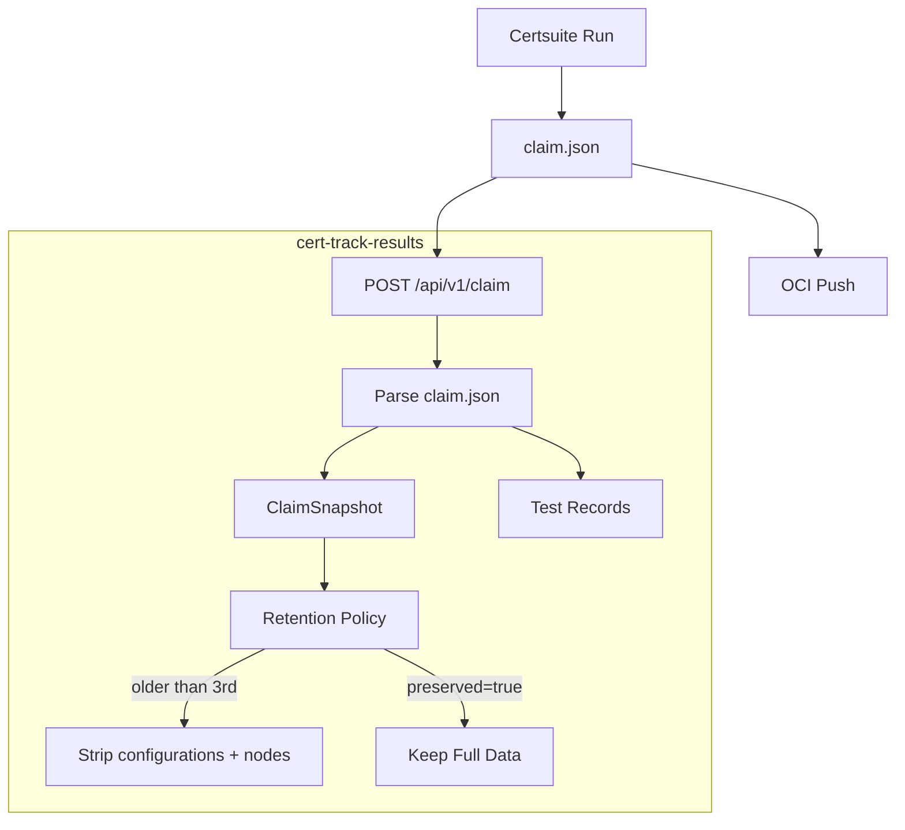

# Architecture Guide

This document describes the end-to-end workflow of the Konflux Certsuite
shared test pipeline, how concurrency is managed, how cluster state is
restored, and how results flow to the cert-track-results web application.

## System Overview



## Pipeline Flow

The pipeline executes the following stages in order. If any stage fails,
the `finally` block ensures the cluster is cleaned up and the lock is
released.



### Stage Details

| # | Task | Purpose |
|---|------|---------|
| 1 | `parse-metadata` | Extract FBC image, git URL, and revision from the Konflux Snapshot |
| 2 | `get-unreleased-bundle` | Retrieve the unreleased operator bundle from the FBC fragment |
| 3 | `acquire-cluster-lock` | Create a Kubernetes Lease to serialize access to the shared cluster |
| 4 | `oadp-restore-pre` | Restore the cluster to the clean baseline using OADP |
| 5 | `deploy-operator` | Install the operator via OLM (CatalogSource, Subscription, CSV) |
| 6 | `deploy-operands` | Apply the test bundle's operand manifests and wait for readiness |
| 7 | `run-certsuite` | Execute certsuite suites specified by the `CERTSUITE_LABELS` param |
| 8 | `collect-results` | POST claim.json to cert-track-results, push tarball to OCI registry |

## Concurrency: Lease-Based Queueing

Multiple Konflux projects can share the same test cluster. A Kubernetes
Lease in the `certsuite-locks` namespace acts as a mutex:



**Stale lock protection**: each Lease carries a `leaseDurationSeconds` (TTL).
If a pipeline crashes without running its `finally` block, the next pipeline
detects the expired lease and deletes it automatically.

## OADP Backup / Restore

The pipeline uses OADP (OpenShift API for Data Protection, built on Velero)
to snapshot and restore cluster state:



**What OADP restores**: namespace-scoped resources (Deployments, Services,
ConfigMaps, Secrets, PVCs) and cluster-scoped resources (CRDs,
ClusterRoles). It does *not* restore etcd or OpenShift platform operators.

**What the cleanup task removes**: the explicit OLM resources (Subscription,
CSV, CatalogSource, OperatorGroup), operator-installed CRDs, and the
install/operand namespaces. OADP restore then handles any remaining drift.

## Operator Test Bundle

The test bundle is a directory (hosted in a git repo or OCI image) that
operator owners create. It tells the pipeline how to deploy operands in
a software-only mode suitable for certsuite testing.

```
my-operator-test-bundle/
  certsuite-test-bundle.yaml    # Bundle metadata (namespace, readiness, etc.)
  certsuite_config.yml          # Certsuite configuration for this operator
  prerequisites/                # (optional) Secrets, ConfigMaps needed first
    secret.yaml
  operands/                     # Kubernetes manifests for operand instances
    my-custom-resource.yaml
    deployment.yaml
    service.yaml
```

The bundle is fetched by the `deploy-operands` task using the
`TEST_BUNDLE_REF` pipeline parameter. See the
[Operator Onboarding Guide](operator-onboarding-guide.md) for how to
create one.

## Results Flow



### Retention Policy

For each `(operator, release)` pair:

1. The **3 newest** ClaimSnapshots retain full debug data (`configurations`
   and `nodes` sections from claim.json).
2. Older snapshots have `configurations` and `nodes` set to NULL to save
   space. Per-test fields (`checkDetails`, `capturedTestOutput`) are always
   kept.
3. Users can mark a snapshot as **preserved** via the cert-track-results UI
   to exempt it from stripping.

## Adding a New Operator

1. Create a [test bundle](#operator-test-bundle) in your operator's
   repository.
2. Validate it locally with `tools/validate-test-bundle.sh`.
3. Create an `IntegrationTestScenario` in your Konflux tenant config.
   See [examples/integration-test-scenario.yaml](../examples/integration-test-scenario.yaml).
4. Ensure the required Secrets exist in your tenant namespace:
   - `shared-cluster-kubeconfig` -- kubeconfig for the shared cluster
   - `cert-track-api-token` -- API token for cert-track-results
   - `quay-dockerconfig` -- OCI registry credentials
5. Merge a change to your FBC component -- the pipeline triggers
   automatically on push events.
